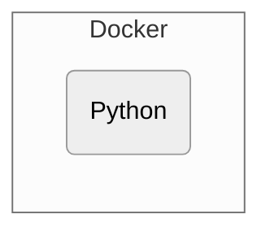

# python-boilerplate

<!-- Badges -->
[](https://github.com/shin-sforzando/python-boilerplate/graphs/commit-activity)
[](https://github.com/shin-sforzando/python-boilerplate/actions/workflows/ci.yml)
[](https://codecov.io/gh/shin-sforzando/python-boilerplate)
[](https://shin-sforzando.github.io/python-boilerplate/)
[](http://commitizen.github.io/cz-cli/)
[](https://opensource.org/licenses/MIT)

<!-- Screenshots -->
|  |  |
|:--------------------------------------------------------------------------------------:|:--------------------------------------------------------------------------------------:|
|                                      Screenshot 1                                      |                                      Screenshot 2                                      |

<!-- Synopsis -->
**python-boilerplate** is a template repository for using Docker & Python.

### *Use this template*

- [ ] Replace the string `shin-sforzando` with the actual project owner
- [ ] Replace the string `python-boilerplate` with the actual project name
- [ ] Create an issue `#1` for screenshots
- [ ] `lefthook install` to install git hooks
- [ ] Check the [repository secrets](https://github.com/shin-sforzando/python-boilerplate/settings/secrets/actions)
  - [ ] `git secret remove dev@sforzando.co.jp.asc` to delete it
  - [ ] Set `CODECOV_TOKEN` of this repository if it's **private**
  - [ ] Check `codecov` step in `.github/workflows/ci.yml` if it's **private**
- [ ] Prepare [GitHub Pages](https://github.com/shin-sforzando/python-boilerplate/settings/pages)
- [ ] Delete `.github/workflows/codeql-analysis.yml` if it's **private**
- [ ] Integrate with Slack: `/github subscribe shin-sforzando/python-boilerplate reviews comments branches commits:*`
- [ ] **Delete this section!**

<!-- TOC -->
- [Prerequisites](#prerequisites)
- [How to](#how-to)
  - [First time preparetion](#first-time-preparetion)
    - [Reveal Secrets](#reveal-secrets)
    - [Setup Git Hooks (Lefthook)](#setup-git-hooks-lefthook)
  - [Develop](#develop)
    - [`.env`](#env)
    - [Start](#start)
    - [Shell](#shell)
    - [Format](#format)
    - [Lint](#lint)
    - [Test](#test)
  - [Document](#document)
    - [API Document](#api-document)
    - [CHANGELOG](#changelog)
  - [Deploy](#deploy)
  - [Clean](#clean)
- [Misc](#misc)
- [Notes](#notes)
  - [LICENSE](#license)
  - [Contributors](#contributors)

## Prerequisites



- [Docker](https://www.docker.com) as *Environment Isolator*
  - [Python](https://www.python.org) (Version 3.10 or higher)
    - Production Dependencies
      - (T. B. D.)
    - Development Dependencies
      - [black](https://github.com/psf/black) as *Python Formatter*
      - [flake8](https://pypi.org/project/flake8/) as *Python Code Linter*
      - [Sphinx](https://www.sphinx-doc.org/) as *Python Document Generator*
      - [loguru](https://github.com/Delgan/loguru) as *Application Logger*
      - [pytest](https://pypi.org/project/pytest/) for *Application Test*
        - [pytest-xdist](https://pypi.org/project/pytest-xdist/) for *Parallel Testing*
  - [secretlint](https://github.com/secretlint/secretlint) as *Credential Linter*
- [Lefthook](https://github.com/evilmartians/lefthook) as *Git Hooks Manager*
- [git-secret](https://git-secret.io/) as *Secret File Manager*
- [direnv](https://direnv.net) as *`.env` Loader*

## How to

```shell
$ make help
default              常用
ps                   状況
build                構築
up                   起動
renew                転生
shell                接続
logs                 記録
follow               追跡
open                 閲覧
hide                 秘匿
reveal               暴露
start                開始
format               整形
lint                 検証
test                 試験
doc                  文書
deploy               配備
stop                 停止
down                 削除
clean                掃除
prune                破滅
help                 助言
```

### First time preparetion

#### Reveal Secrets

To install [git-secret](https://git-secret.io/) via [Homebrew](https://brew.sh), `brew install git-secret`.
To install [direnv](https://direnv.net) via [Homebrew](https://brew.sh), `brew install direnv`.

Developers who share a GPG key with their team can decrypt confidential information.

To reveal the secret information (= `*.secrets`), run below.

```shell
make reveal
```

If there are `.env` -like files included in `*.secrets`, [direnv](https://direnv.net) try to load them automatically.
`direnv allow` to approve it.

On the other hand, to encrypt the updated secret information, run below.

```shell
make hide
```

#### Setup Git Hooks (Lefthook)

To install [Lefthook](https://github.com/evilmartians/lefthook) via [Homebrew](https://brew.sh), `brew install lefthook`.

```shell
lefthook install
```

Thereafter, each commit will validate by `make format` and `make lint`, and each push will validate by `make test` and [secretlint](https://github.com/secretlint/secretlint).

### Develop

Commands that are often used during development should be prepared in `default`.

```shell
make
```

#### `.env`

Make sure there is `.env` like below before starting development.

```.env
DEBUG=True
```

Usually, `.env` is prepared by [Reveal Secrets](#reveal-secrets) action.
Don't forget that it needs to run `direnv allow` every time the `.env` is changed.

#### Start

If it succeeds, [http.server](https://docs.python.org/3/library/http.server.html) will start waiting on `http://0.0.0.0:8000/`.
To check this address, run below.

```shell
make open
```

To view container's log, run one of the following commands.

```shell
make logs    # View last output from containers.
make follow  # Follow outputs from containers.
```

#### Shell

To connect `app` container using Bash, run below.

```shell
make bash
```

#### Format

To format Python source codes using [Black](https://github.com/psf/black) manually, run below.

```shell
make format
```

#### Lint

To lint Python source codes using [flake8](https://pypi.org/project/flake8/) manually, run below.

```shell
make lint
```

#### Test

To test Python source codes using [pytest](https://docs.pytest.org/) manually, run below.

```shell
make test
```

### Document

#### API Document

When the main branch is updated, `pages.yml` will update the [API Document](https://shin-sforzando.github.io/python-boilerplate/).

To generate API Documents using [Sphinx](https://www.sphinx-doc.org/) manually, run below.

```shell
make doc
```

#### CHANGELOG

To install [git-cliff](https://github.com/orhun/git-cliff) via [Homebrew](https://brew.sh), `brew install git-cliff`.

To update `CHANGELOG.md` manually, run [git-cliff](https://github.com/orhun/git-cliff) like below.

```shell
git cliff --output CHANGELOG.md
```

### Deploy

To deploy this to `(T. B. D.)` manually, run below.

```shell
make deploy
```

### Clean

To clean up miscellaneous files, run below.

```shell
make clean
```

## Misc

## Notes

This repository is [Commitizen](https://commitizen.github.io/cz-cli/) friendly, following [GitHub flow](https://docs.github.com/en/get-started/quickstart/github-flow).
See [CONTRIBUTING.md](./CONTRIBUTING.md) for details.

### LICENSE

See [LICENSE](LICENSE).

### Contributors

- [sforzando LLC. and Inc.](https://sforzando.co.jp/)
  - [Shin'ichiro Suzuki](https://github.com/shin-sforzando)
